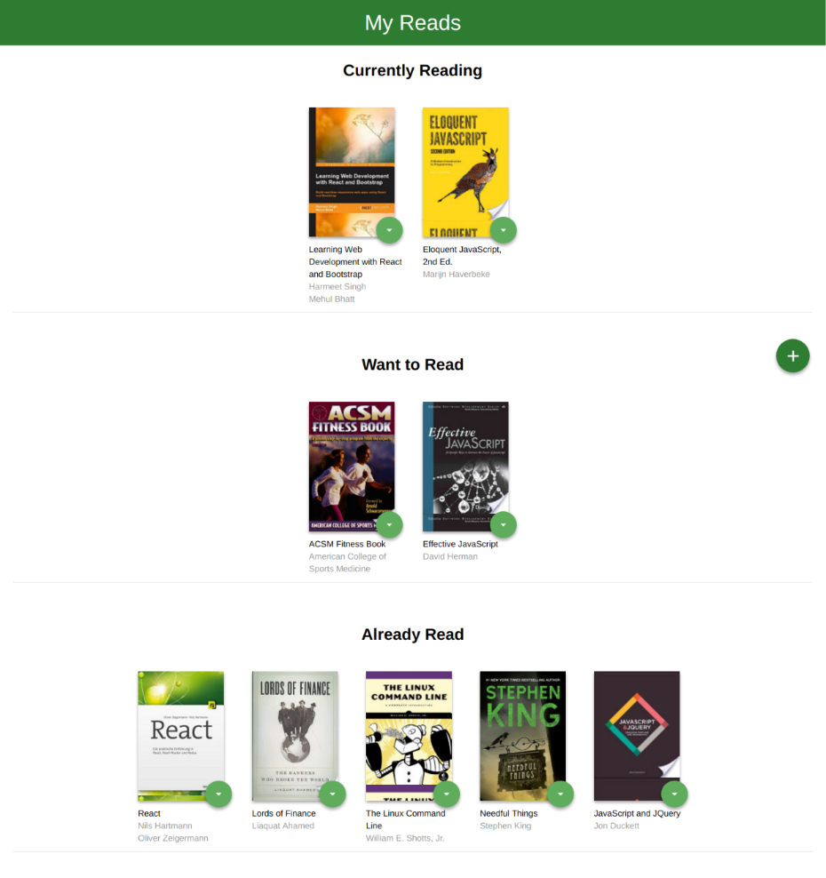
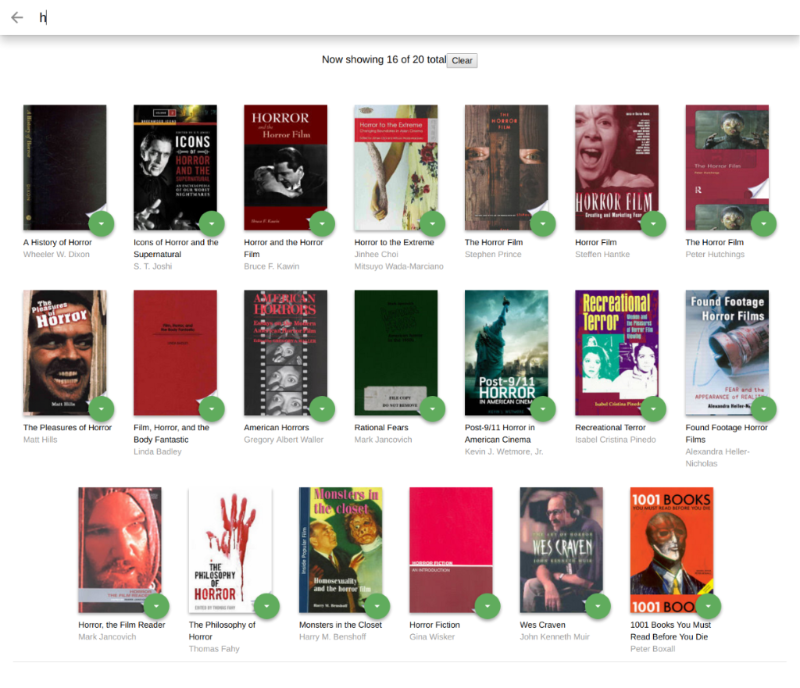

# MyReads
This project is purely academic.  This is a homework assignment for the React nanodegree on udacity.org.  

## Installation

Clone this repo or download the zip and extract to a convenient folder on your local machine. 
switch to the repo directory.  From your CLI run the following:

```
npm install
```
or
```
yarn install
```
Once the dependencies have all successfully installed, simply run 
```
npm start
```
or 
```
yarn start
``` 

React scripts should run and open your browser to `localhost:3000`, which will display a book case with three shelves as below.



Clicking any of the drop-down selections on any book will move the book to that shelf.  

Clicking the plus sign ( :plus_sign: ) icon on this page will take you to the search page, where you can search more books and add them to your shelf.

## Important
The backend API uses a fixed set of cached search results and is limited to a particular set of search terms, which can be found in [SEARCH_TERMS.md](./SEARCH_TERMS.md). That list of terms are the only terms that will work with the backend, so don't be surprised if your searches for Basket Weaving or Bubble Wrap don't come back with any results.

